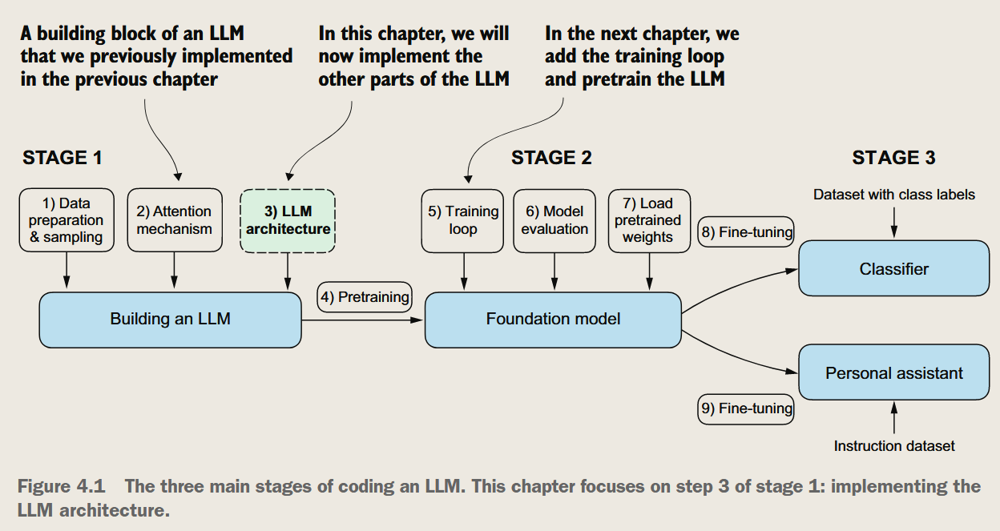
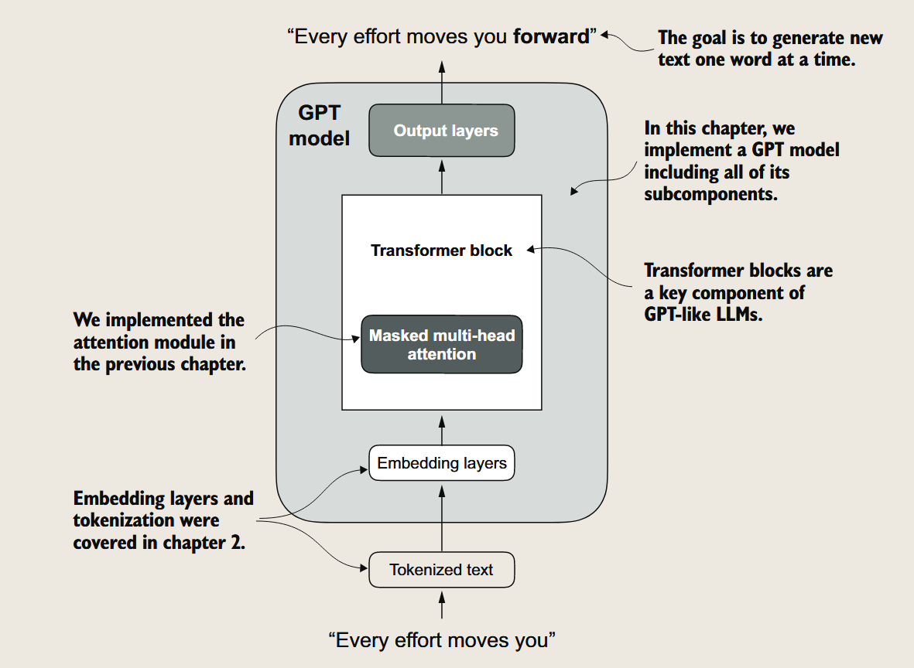
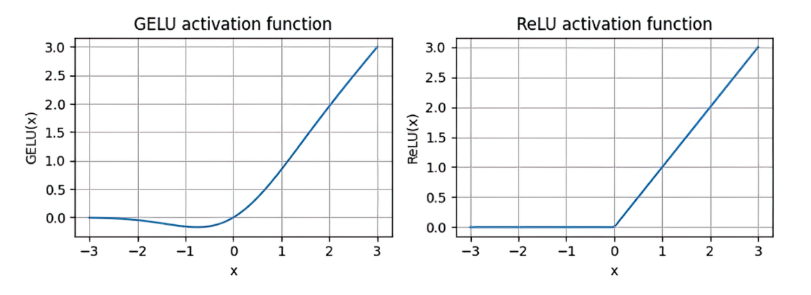
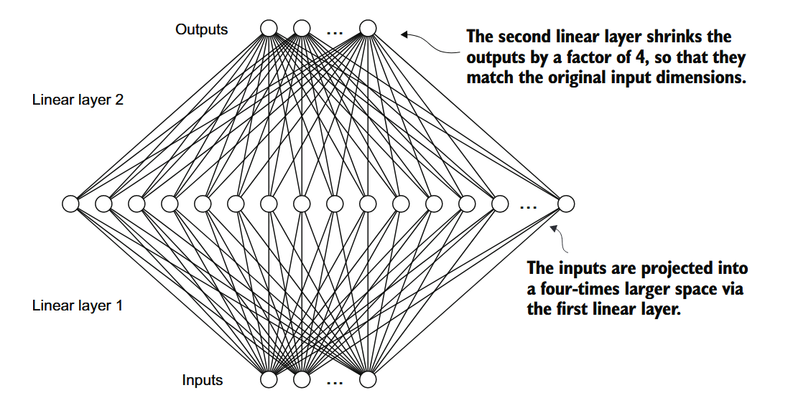
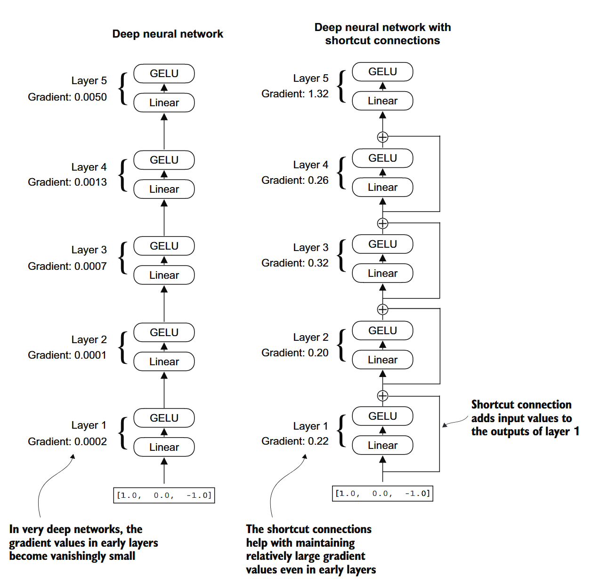
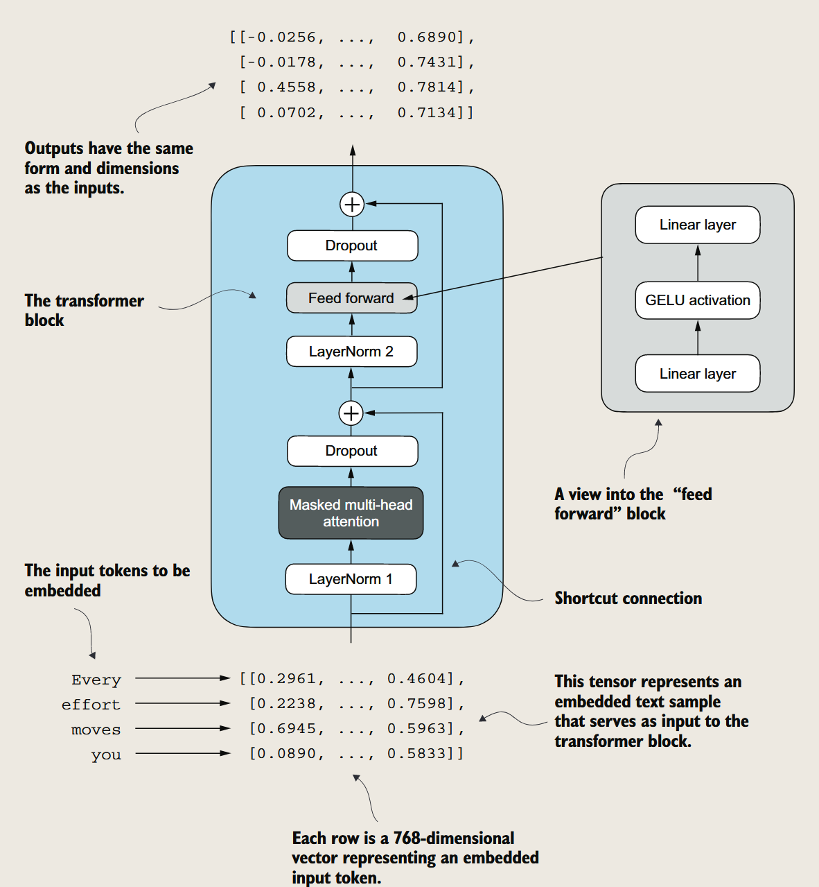
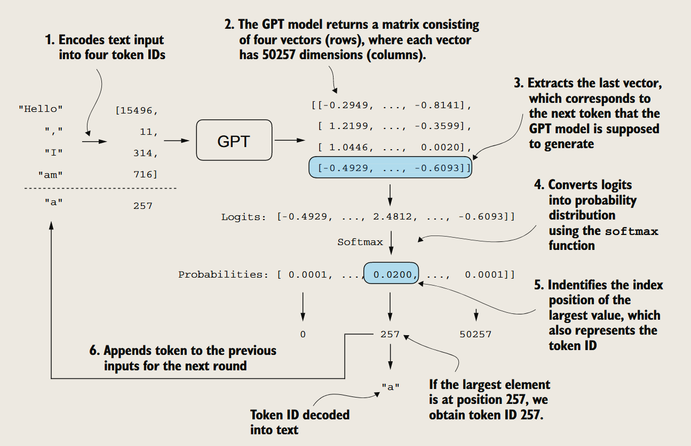
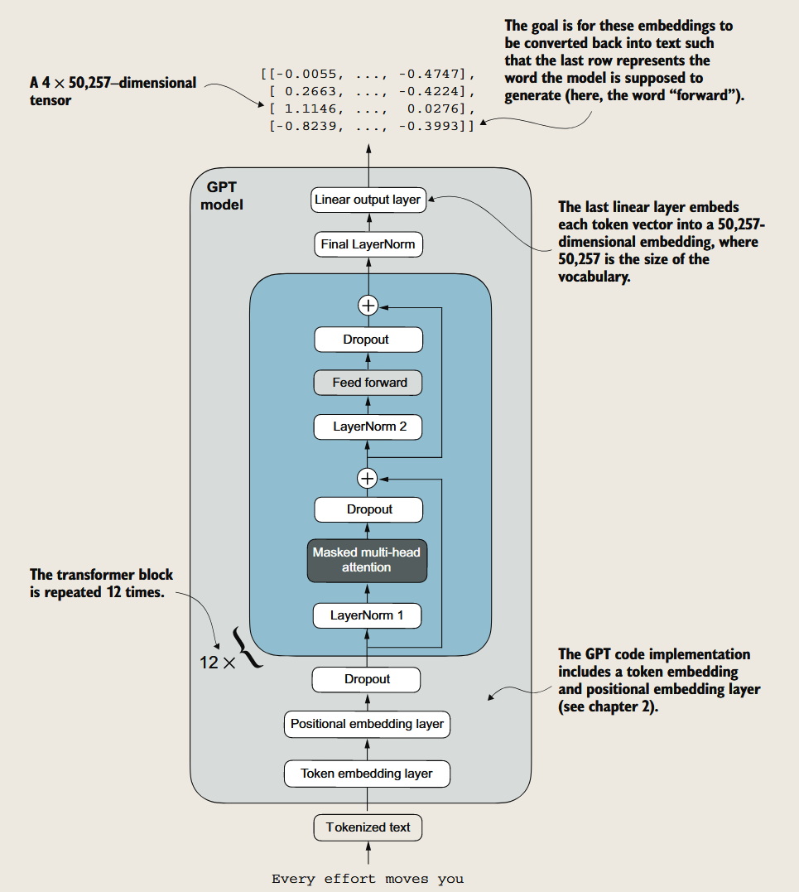

从零开始实现GPT模型以生成文本

现在进度是Stage1的第三步

*GPT模型示意图*

我们已经实现了嵌入层和多头注意力机制，下面完善Transformer块的其他部分

## GPT结构
> 注意，现在学的 Transformer 块 主要是在理解 GPT（解码器-only 结构），而 BERT（纯编码器） 的工作方式是不一样的。
### 层归一化（Layer Normalization）

*归一化的目的：使**激活值**均值为0，方差为1*

对每个**token**的隐藏状态进行归一化，而不是对某个头的所有**token**进行归一化

(跨特征维度进行归一化)
> *举例*
>
| Token | 原始向量 | 归一化后向量 |
|-------|---------|-------------|
| "我" | [0.5, -0.2, 1.3] | [0.2, -0.8, 0.6] |
| "爱" | [0.7, 0.1, -0.5] | [0.9, 0.0, -0.9] |
| "机器学习" | [0.4, 1.2, 0.6] | [-0.5, 1.0, -0.5] |

（对于“我”、“爱”、“机器学习”三个词的隐藏状态分别进行归一化，而不是对于这三个token的第一列，第二列，第三列进行归一化）

#### layer norm的使用场景
`输入 -> Layer Normalization -> 多头注意力 -> 残差连接 -> Layer Normalization -> 前馈网络 -> 残差连接`

### 在前馈网络是用GELU激活函数

对比GELU和ReLU的激活函数

在负值始终有非零的梯度 -> 输入为负的神经元不会直接关闭，同样会有梯度传递

前馈网络（Feed Forward Network）的使用场景：
对自注意力输出的隐藏状态**升维、激活、再还原**，显著增强了特征的表达能力。

*前馈网络的示意图*，先升高维度，再GELU激活，再还原到原始维度

### 残差连接（Residual Connection/Shortcut Connection）
$输出=F(x)+x$

避免梯度消失，如果某一层没有学到有用的东西，还能保留原来的信息

*防止深度网络中早期层的梯度消失*

### 拼接成完整的Transformer块

- **输入**：tokens的嵌入向量+*位置编码*
- 层归一化 + 多头 + 随机失活(Dropout) + 残差连接
- 层归一化 + 前馈网络 + 残差连接
- **输出**：和输入***相同维度*** 的隐藏状态

> 新的Transformer通常在MSA之前使用归一化，并加入Dropout

#### Transformer块的权重共享（Weight Sharing）
- MSA的权重共享：Q、K、V的权重矩阵是一样的
- 位置编码是固定的
- Transformer层**结构**相同
- 层权重共享（Weight Tying）

## 解码

*解码器发挥的作用*

> 澄清一下，**上图的GPT框框对应着多个Transformer块的堆叠**

*Transformer块（解码器）的结构*

Token 嵌入 → GPT模型 → 输出隐藏状态 → 最后一行向量 → Softmax → 预测下一个 token

> 下面要解决的是GPT之后的部分，把隐藏状态对应到下一个token

### 小结

### 小结

1. **层归一化**：通过*确保每一层的输出具有稳定一致的均值和方差*来稳定训练过程。

2. **跳跃连接**：通过*将一层网络的输出直接馈送到更深层网络*，从而跳过一层或多层的连接方式，有助于*减轻训练深度神经网络时梯度消失的问题*。

3. **Transformer块**：GPT模型的核心结构组件，它结合了*掩码多头注意力模块*和使用*GELU激活函数的全连接前馈网络*。

4. **GPT模型特点**：
   - 具有许多重复的**Transformer块**
   - 参数数量从*数百万到数十亿*不等
   - 不同尺寸的模型（*1.24亿、3.45亿、7.62亿和15.42亿参数*）均可使用相同的**GPTModel** Python类实现

5. **文本生成机制**：通过*基于给定输入上下文依次预测单个词元*来将输出张量解码成人类可读的文本。

6. **训练重要性**：未经训练的GPT模型会生成*语义不通顺的文本*，这突显了模型训练对于*生成连贯文本的重要性*。