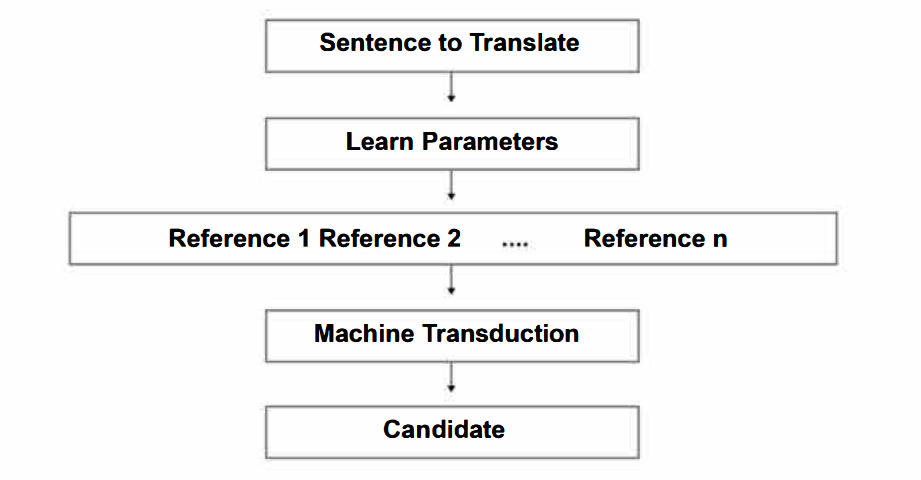

### 机器翻译

- 学习词语之间的对应关系
- 学习词语互相指代的关系
- 机器转导：将一个序列转换为另一个序列

#### 数据集
WMT French-English数据集

预处理
- 清除特殊字符
- 移除小于min_occurrence的词节约性能
- 处理OOV（Out of Vocabulary）问题

#### 评价指标
- n-gram：文本中连续的 N 个词语的序列
- $P_n$：n-gram的精确度，也就是机器译文的n-gram在参考译文中的比例
    > 早期BLEU并不考虑同义词，必须完全匹配才算正确
- 几何平均 (Geometric Mean)：$GM = \sqrt[n]{\prod_{i=1}^{n}P_i}$，聚合1-4 gram的BLEU分数

> Google Trax库开发
> 
> - Layers (层): 这是 Trax 的基本构建模块，例如 tl.Dense (全连接层), tl.Conv (卷积层), tl.LSTM (LSTM 循环神经网络层), tl.Attention (注意力机制层) 等等。
> - Models (模型): 这是由层构建的模型，例如 tl.Serial (串联模型), tl.Branch (分支模型), tl.Residual (残差模型) 等等。
> - Trainers (训练器): 这是用于训练模型的对象，例如 trax.supervised.training.Trainer。
> - Datasets (数据集): 这是用于加载数据的对象，例如 trax.data.inputs.Inputs。

### 发散性联想任务 (Divergent Association Task)

既可以作为模型的评价指标，也可以选择相似度远的词语来提高创造力

### 生成式构思